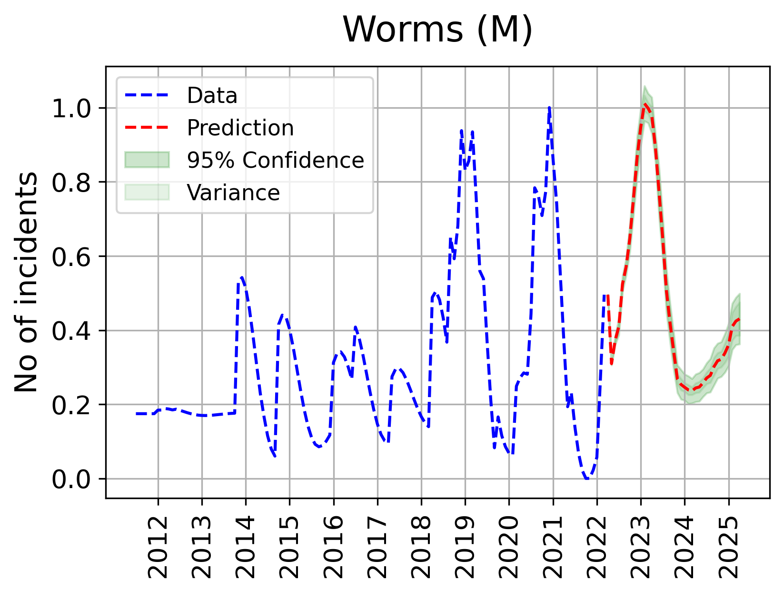

Code of paper "A holistic and proactive approach to forecasting cyber threats".

**This project contains univariate and multivariate implementation of Bayesian Long short-term memory (B-LSTM) for forecasting cyber-threats 3 years in advance**.

# Dataset
The dataset used for forecasting cyber-threat can be found [here](https://github.com/zaidalmahmoud/Cyber-threat-forecast/blob/main/univariate/input_data/T-HMGDN-F-0711-0322.csv).

# Project overview
Each of the univariate and multivariate folders contains 2 jupyter-notebooks. The first is for optimising the model, called "hp_optimisation_u" or "hp_optimisation_m", and the second for the final forecast, called "forecast_u" or "forecast_m". The dataset is in the directory "input_data" and is read in the code. The model optimisation code writes the results to 2 folders, which are "output_validation_results" and "output_hyperparameters". The "output_validation_results" contains some plots and hyperparameters of good performing models (error below some threshold), while the folder "output_hyperparameters" contains the hyperparameters of the final optimised models. The "forecast" code reads the optimised model hyperparameters from the folder "output_hyperparameters" to train the final model on the complete data and generate future trend forecasts using 3 different seeds (to choose the most reasonable from the 3 results). These forecasts are saved to the folder "output_forecast" as text files and plots.

# Output examples
Below is an example of a validation result for the forecast of the brute force attack, when running the code "hp_optimisation_u". The model learns the time-series pattern from the history and can produce a forecast, which is well-aligned with the actual trend. (U) indicates a univariate model. This plot is saved to the folder "output_validation_results".

Below is an example of 3 years forecast for the worms attack, as an output of the code "forecast_m". The model predicts the trend 3 years in advance until 2025, while using multiple features. The Bayesian distribution is illustrated by the 95% confidence interval and variance areas. The increase of these green areas over time indicates an increase in the model's uncertainty. (M) indicates a multivariate model. This plot is saved to the folder "output_forecast".

# Notes
In the model optimisation code, 42 models for 42 attack types are optimised and saved. In the forecast code, the attacks included (see "attacks" list) in the univariate approach are those that were better forecasted (had a model with lower error) when using the univariate approach. Similarly, the attacks included in the multivariate approach are those that were better forecasted (had a model with lower error) when using the multivariate approach. However, it is possible to modify the code to forecast all the 42 attacks for each approach, by optimising the model of all attacks in the optimisation code and then adding the missing attacks (their column names) manually to the "attacks" list in the forecast code.

